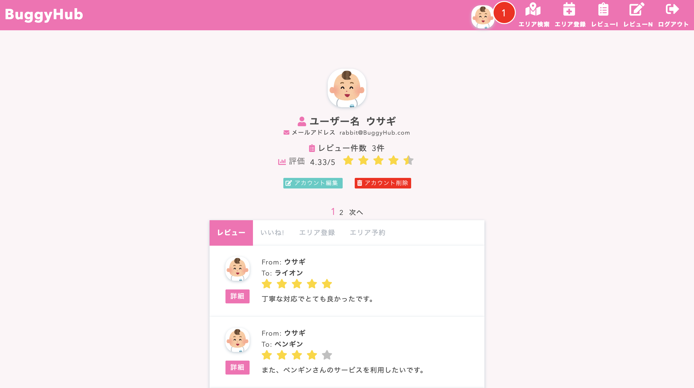
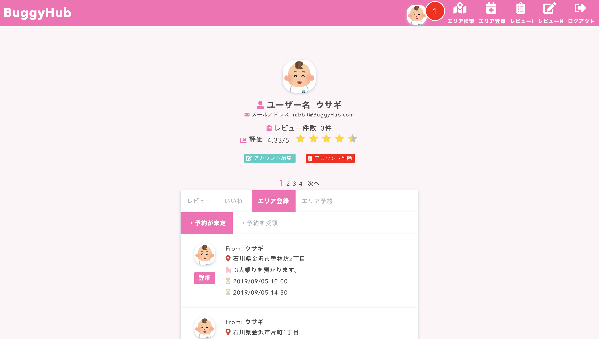
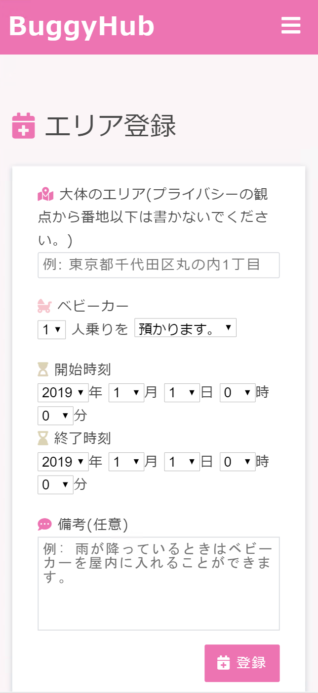
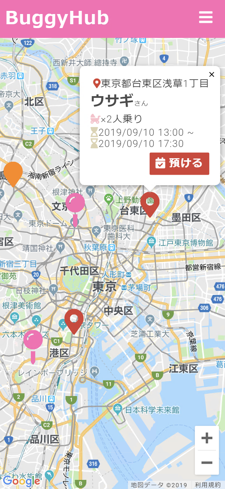
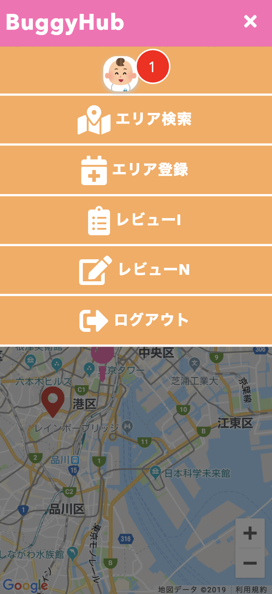

# BuggyHub

url: https://buggy-hub.herokuapp.com/

  

  図1&nbsp;&nbsp;iPhone Xで閲覧したときのトップページの画像

## 概要

&nbsp;&nbsp;BuggyHub(バギーハブ)はベビーカーのシェアリングサービスとして「ベビーカーをコミュニケーションツールに！」を達成目標に運営する Web サイトです。 
&nbsp;&nbsp;満員電車などの狭い空間でベビーカーを使えず、赤ちゃんを抱っこして仕事場または保育所まで行くときは電車に乗る前にサービスが提供されていれば、ベビーカーを預けられるエリアを予約できます。また、電車から降りた後にベビーカーを借りられるエリアも予約できます。休日に赤ちゃんと公園や遊園地などでベビーカーなしで遊ぶときにベビーカーを預けるエリアを予約する目的で BuggyHub を利用されても構いません。 
&nbsp;&nbsp;BuggyHub の Web サイトを通してベビーカーをきっかけにサービス提供者とサービス利用者との交流が生まれ、Buggy(ベビーカー)が Hub(ハブ)となりコミュニケーションツールの 1 つとして認知されることを願っています。

### デモ画像

 
   

  図2&nbsp;&nbsp;閲覧したときのデモ画像(上段…13inchパソコンで閲覧したとき、下段…iPhone Xで閲覧したとき)

## 機能

- ユーザー管理機能

  - ゲストユーザーログイン機能(すべての新規作成とライクが不可)
  - 新規ユーザー登録機能
    - ユーザー名を登録
    - ユーザーのアイコン画像を提示された画像の中から選択して登録
    - メールアドレスを登録
    - パスワードを登録
  - ユーザーログイン機能
    - メールアドレスでログイン
    - パスワードでログイン
  - ユーザー詳細表示機能
    - 投稿したレビューの一覧
    - いいね(ライク)したレビューの一覧
    - エリア登録(予約が未定)の一覧
    - エリア登録(予約を受領)の一覧
    - エリア予約の一覧
  - ユーザー一覧表示機能
    - ユーザー名の表示
    - アイコン画像の表示
    - 星型評価の表示(1 つ星から 5 つ星まで 0.5 段階で表示して、レビュー件数が 0 件のときは星型評価も 0)
  - ユーザーアカウント編集・削除機能(削除機能を使用してもレビューで付けた評価は残ります。)
    - ユーザー名を編集
    - ユーザーのアイコン画像を提示された画像の中から選択して編集
    - メールアドレスを編集

- レビュー管理機能

  - 新規レビュー投稿機能
  - レビュー詳細表示機能
  - レビュー編集・削除機能
  - レビュー一覧表示機能

- エリア管理機能

  - 新規エリア投稿機能
  - エリア詳細表示機能
  - エリア編集・削除機能
  - Google マップによるエリア一覧表示機能

- レビューへのライク管理機能

  - レビューへのライク作成機能
  - レビューへのライク削除機能
  - レビューへのライク総数の表示機能

- 表示件数が多くなるページに対してのページネーション機能

## 使用技術

- 開発環境
  - Windows Subsystem for Linux
- テスト環境
  - 未完成
- 本番環境
  - Heroku
- DB
  - PostgresQ
- Google Cloud Platform
  - Maps JavaScript API
  - Geocoding API
- パスワードを暗号化
  - bcrypt
- ページネーション機能
  - kaminari

## 依存関係

- Rails: 5.2.3
- Ruby: 2.6.2
- Bundle: 2.0.2
